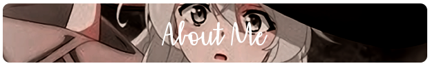

  

 

 
 
 

- Name: **Osama** / **オサーマ**.

- Languages: **Python**, **Node.js**, **PHP**, and **C#**.

- Tools: **Vscode**, **Postman**, **Docker**, and **others**.

- Speaks: Arabic, little in English.

 

    

 
 

 
 
  
- 📗 [***Enmn/KickApi***](https://github.com/Enmn/KickApi)  
  A Python package for interacting with the Kick API to retrieve channel and video data.
- 📘 [***Enmn/KickNoSub***](https://github.com/Enmn/KickNoSub)  
  Extract direct stream URLs from Kick videos in your preferred quality for educational and research purposes.

 
 
“People with evil intent can do evil things without lying. And not all liars are evil.” – Elaina&nbsp;&nbsp;&nbsp;&nbsp;&nbsp;&nbsp;&nbsp;&nbsp;&nbsp;&nbsp;&nbsp;&nbsp;&nbsp;&nbsp;&nbsp;&nbsp;&nbsp;&nbsp;&nbsp;&nbsp;&nbsp;&nbsp;&nbsp;&nbsp;&nbsp;&nbsp;&nbsp;&nbsp;&nbsp;&nbsp;&nbsp;&nbsp;&nbsp;&nbsp;&nbsp;&nbsp;&nbsp;&nbsp;&nbsp;&nbsp;&nbsp;&nbsp;&nbsp;&nbsp;&nbsp;&nbsp;&nbsp;&nbsp;&nbsp;&nbsp;&nbsp;&nbsp;&nbsp;&nbsp;&nbsp;&nbsp;&nbsp;
  

